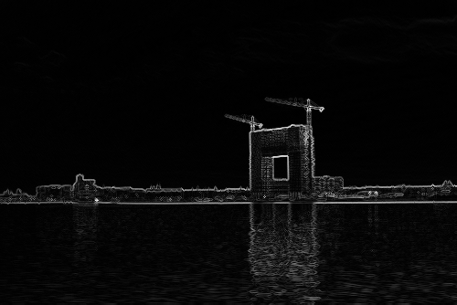

# Seam Carving

Seam carving is an image processing technique for content aware image resizing. 

## Stage 1/6: Create an image:
In this stage, a rectangle image of provided width and height is created, with a red rectangle drawn diagonally
on both sides.

[Open stage 1 on Hyperskill](https://hyperskill.org/projects/100/stages/550/implement)

Stage implementation: [RectangleBuilder.kt](src/main/kotlin/seamcarving/RectangleBuilder.kt)

Example

    Enter rectangle width:
    > 20
    Enter rectangle height:
    > 10
    Enter output image name:
    > out.png

out.png looks like this:

## Stage 2/6: Negative photo:

In this stage, our Kotlin program converts an image into a negative one, by
inverting its rgb values.

Inverted color for `(r, g, b)` is `(255 - r, 255 - g, 255 - b)`

[Open stage 2 on Hyperskill](https://hyperskill.org/projects/100/stages/551/implement)

Stage implementation:  [ColorInverter.kt](src/main/kotlin/seamcarving/ColorInverter.kt)

Args: `-in inputPath\imageName.png -out outputPath\outputImageName.png`

Example:

>args: `-in sky.png -out sky_negative.png`
> 
>For the following sky.png:
> 
> 
> 
> sky-negative.png looks like:
> 
> 

Stage 3/6: Look at energy:

In this stage, the energy for each pixel is calculated using the **dual-gradient energy function.**

Then, the energies are normalised using the following formula:

`intensity = (255.0 * energy / maxEnergyValue).toInt()`

And each pixel's rgb values are set to the `intensity` value, so the energy is represented as a grey-scale image.

[Open stage 3 on Hyperskill](https://hyperskill.org/projects/100/stages/552/implement)

Stage implementation: [EnergyCalculator.kt](src/main/kotlin/seamcarving/EnergyCalculator.kt)

Example:

>-in sky.png -out sky-energy.png
> 
> For the following sky.png:
> 
> 
> 
> sky-energy.png looks like:
> 
> 